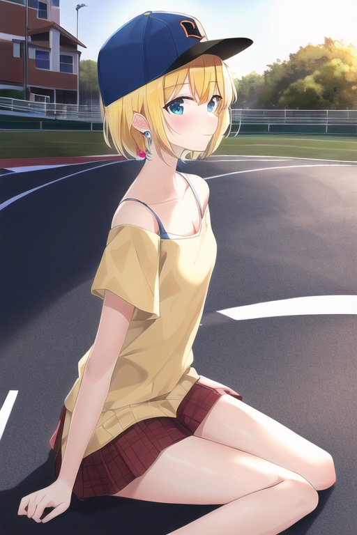

# プロンプトの検証
2023/3/19 Sun.

## 想定シーンと今日の最終形→
**駐車場に止まる車が見える風景を背に
女の子がこっちを見ているシーン**


---
### 前提：
- `Stable Diffusion`
    - Step:`28`
    - Scale:`15`
    - Seed: 固定せず
- 構文
    - `{}` ⇒強める , `()` ⇒弱める
    - `[]` ->整理のために使用

---

### 001:風景のみ
```json
situation: 
straight road, sunlight, location: japan
```


---

### 002:風景＋女の子

```json
`{girl: yellow hair, short hair, blue eyes,
18 years old},
situation: straight road, sunlight,
location: japan
```


---

### 003:より具体化

```json
{{girl: yellow hair, short hair, blue eyes, 18 years old},
 attire: Black baseball cap, white dress, red short skirt,
 blue small blue earrings,
 looking at the view,
 {Posture: Hands up}
},
[situation: on the sidewalk next to the roadway],
[Weather: Sunny, wind], 
[location: japan],
[Effect: sunlight]
```


---


---




---


---

### 004:女の子のポーズ指定
```json
[{girl: yellow hair, short hair, blue eyes, 18 years old},
 attire: Black baseball cap, white dress, red short skirt, 
 blue small blue earrings,
 looking at the view, standing
],
[situation: on the sidewalk next to the roadway],
[Weather: Sunny, wind], 
[location: japan],
[Effect: sunlight]
```
---


---


---


---
### 005:ポーズの指定改良
```json
[{girl: yellow hair, short hair, blue eyes, 18 years old},
 attire: Black baseball cap, white dress, red short skirt, 
 blue small earrings,
 looking at the view,
 standing, waving
],
[situation: on the sidewalk next to the roadway],
[Weather: Sunny, wind], 
[location: japan],
[Effect: sunlight]
```


---


-> 女の子の設定と状況は以上とし、
風景の方を細かく詰めていく

※指がおかしい点込みで


---

### 006:コンビニ・車の情報を足す
```json
[situation: on the sidewalk next to the roadway,
small convenience store next to the road,
{1 car is parked in the parking lot}
],
[Weather: Sunny, wind], 
[location: japan],
[Effect: sunlight]
```

---


---

### 007: 車が安定しなかったので改良
```json
{One blue car: parked in the parking lot},
[situation: on the sidewalk next to the roadway,
small convenience store next to the road],
[Weather: Sunny, wind], 
[location: japan],
[Effect: sunlight]
```

---


---

### 008: 風景と女の子のプロンプトを結合
```json
[{girl: yellow hair, short hair, blue eyes, 18 years old},
 attire: Black baseball cap, white dress, red short skirt, 
 blue small blue earrings,
 looking at the view, {hands extended out to the side},
 standing, waving
],
{One blue car: parked in the parking lot},
[situation: on the sidewalk next to the roadway,
small convenience store next to the road],
[Weather: Sunny, wind], 
[location: japan],
[Effect: sunlight]
```

---


問題発生！

構成が複雑になったからか、
指や顔の細部が崩れやすくなる。

---
ネガティブプロンプトを用意
```json
low quality, worst quality, out of focus, ugly,
error, jpeg artifacts, lowers, blurry,  bad anatomy,
long_neck, long_body, deformed mutated disfigured,
missing arms, extra_arms, {mutated hands}, extra_legs,
{bad hands}, poorly_drawn_hands, {malformed_hands},
 missing_limb, floating_limbs, disconnected_limbs,
{extra_fingers}, {bad fingers}, liquid fingers, 
poorly drawn fingers, missing fingers, extra digit, 
fewer digits, ugly face, deformed eyes, partial face,
partial head, bad face, inaccurate limb, cropped, 2 girls, 2 person, 4 fingers
```
---


---

### 009: 最終

#### ポジティブ
```json
[{{girl: yellow hair, short hair, blue eyes, 18 years old}}, 
Black baseball cap, white dress, red short skirt,
blue small earrings,
standing　on the sidewalk next to the roadway,
waving,
looking at the view,
],
[background: 
One blue car parked in the parking lot,
small convenience store next to the road], 
[Weather: Sunny, wind],
[location: japan],
[Effect: sunlight]
```

---

#### ネガティブ
```json
low quality, worst quality, out of focus, ugly,
error, jpeg artifacts, lowers, blurry,  bad anatomy,
long_neck, long_body, deformed mutated disfigured,
missing arms, extra_arms, {mutated hands}, extra_legs,
{bad hands}, poorly_drawn_hands, {malformed_hands},
 missing_limb, floating_limbs, disconnected_limbs,
{extra_fingers}, {bad fingers}, liquid fingers, 
poorly drawn fingers, missing fingers, extra digit, 
fewer digits, ugly face, deformed eyes, partial face,
partial head, bad face, inaccurate limb, cropped, 2 girls, 2 person, 4 fingers
```


## 学び
- シーンの組み方
- 強化・弱化の重要性
- さらにネガティブプロンプトの重要性


## 今回やっていない品質アップにつながるポイント
- カメラアングルの調整
- シーン全体へのエフェクト適用
- 表情指定
- ポーズの具体的な指定
- ハイレベルなアップスケール
- Seed固定
- StepとScaleの詰め


---

以上
