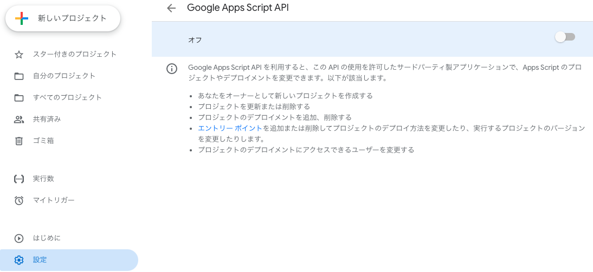

## Claspを試す（3/22）

GASを書く際、履歴管理できてCLIでデプロイできるものがないか調査。`Clasp`にたどり着いた。お手軽かつ非常に便利！


https://github.com/google/clasp

### 1. clasp導入
- GASの全体設定からAPI有効化

- `npm init -y`後、`npm`で以下を導入
    - clasp
    - types
    ```bash
    npm install @google/clasp -g
    npm install @types/google-apps-script
    ```

### 認証エラーの場合
- `clasp login --no-localhost`
    > アクセスをブロック: clasp – The Apps Script CLI のリクエストは無効です

↓
- `clasp login`
    > Logged in! You may close this page. 

    > Login
    > Logs the user in. Saves the client credentials to a .clasprc.json file.
    > Options
    > --no-localhost: Do not run a local server, manually enter code instead.
    > --creds <file>: Use custom credentials used for clasp run. Saves a .clasprc.json file to current working directory. This file should be private!
    > --status: Print who you are currently logged in as, if anyone.
    > https://github.com/google/clasp#login

### 2. プロジェクト作成
```bash
clasp create
```

```bash
? Create which script? sheets
Created new Google Sheet: https://drive.google.com/open?id=xxxxxxxxxxxxxxx
Created new Google Sheets Add-on script: https://script.google.com/d/xxxxxxxxxxxxxxx/edit
Warning: files in subfolder are not accounted for unless you set a '/Current/Folder/.claspignore' file.
Cloned 1 file.
└─ /Current/Folder/appsscript.json
```

### 3. コード書く

- [main.js](Source/Clasp/main.js)

```js
/*
呼び出し元
const SHEET_ID = 'xxxxx';
const SHEET_NAME = 'xxxxxx';
isSheetExist(SHEET_ID, SHEET_NAME);
*/

/**
 * シート存在チェックを行う
 * 
 */
function isSheetExist(sheetId, sheetName) {
  let spreadsheet = SpreadsheetApp.openById(sheetId);
  let ss = spreadsheet.getSheetByName(sheetName);
  if (ss) {
    return true;// 存在する
  }
  else {
    return false;
  }
}
```

### 4. デプロイ
```bash
clasp push
```

## 参考：コマンド一覧

### Basic Commands
```bash
clasp login [--no-localhost] [--creds <file>] [--status]
clasp logout
clasp create [--title <title>] [--type <type>] [--rootDir <dir>] [--parentId <id>]
clasp clone <scriptId | scriptURL> [versionNumber] [--rootDir <dir>]
clasp pull [--versionNumber]
clasp push [--watch] [--force]
clasp status [--json]
clasp open [scriptId] [--webapp] [--creds] [--addon] [--deploymentId <id>]
clasp deployments
clasp deploy [--versionNumber <version>] [--description <description>] [--deploymentId <id>]
clasp undeploy [deploymentId] [--all]
clasp version [description]
clasp versions
clasp list
```

### Advanced Commands
> NOTE: These commands require you to add your Project ID.

```bash
clasp logs [--json] [--open] [--setup] [--watch] [--simplified]
clasp apis list
clasp apis enable <api>
clasp apis disable <api>
clasp setting <key> [value]
```

### Clasp Run
> NOTE: This command requires you to bring your own Google API credentials.
```bash
clasp run [functionName] [--nondev] [--params <StringArray>]
```

https://github.com/google/clasp


## 参考：
- https://qiita.com/naoyeah/items/0db5fc82561020f2768e
- https://hackmd.io/@EL6Kp4wMS26B-FUE8_bbaA/HJ5fCKboi
